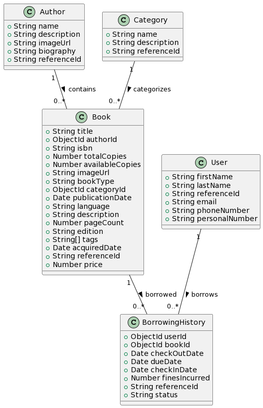

.

# API Documentation

This document provides an overview of the available routes in our API and instructions on how to start the application.

## Available Routes

### Author Routes
- **Create Author:** 
  - Method: `POST`
  - Endpoint: `api/v1/author/create`

- **Get Author by Reference ID:** 
  - Method: `GET`
  - Endpoint: `api/v1/author/:referenceId`

### Category Routes
- **Create Category:** 
  - Method: `POST`
  - Endpoint: `api/v1/category/create`

- **Get Category by Reference ID:** 
  - Method: `GET`
  - Endpoint: `api/v1/category/:referenceId`

### Book Routes
- **Create Book:** 
  - Method: `POST`
  - Endpoint: `api/v1/book/create`

- **Check-in Book:** 
  - Method: `POST`
  - Endpoint: `api/v1/book/checkin`

- **Check-out Book:** 
  - Method: `POST`
  - Endpoint: `api/v1/book/checkout`

- **Get All Books:** 
  - Method: `GET`
  - Endpoint: `api/v1/book`

- **Get Book by Reference ID:** 
  - Method: `GET`
  - Endpoint: `api/v1/book/:referenceId`

- **Search Books:** 
  - Method: `GET`
  - Endpoint: `api/v1/book/search`

### User Routes
- **Create User:** 
  - Method: `POST`
  - Endpoint: `api/v1/user/create`

- **Get User by Email:** 
  - Method: `GET`
  - Endpoint: `api/v1/user/:email`

## Starting the Application

To start the application, follow these steps:

1. **Clone the Repository:**
   ```bash
   git clone [https://github.com/patDevNG/bookService.git]
2. **Install Dependencies:**
   ```bash
   run npm i
3. **Start Application:**
   ```bash
   run docker compose up   
   

